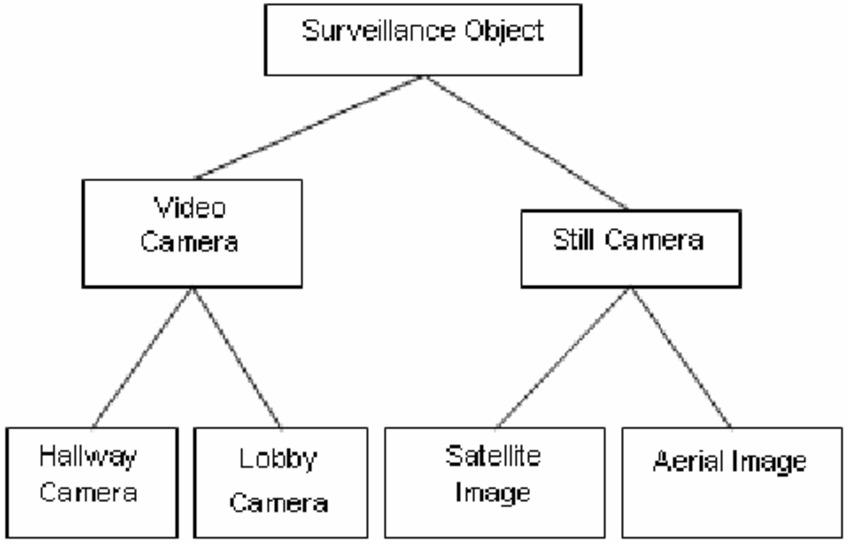

# Inverse-is-a Relationship

Image given below shows an hierarchy of is-a relationship between entities.
That is, in the image shown below, video camera is a surveillance object, still
camera is a surveillance object, hallway camera is a video camera and so on.

Given the name of an entiy, write a C++ program to print the name of the
reverse is-a object name. That is if lobby camera is given then print video
camera.

#### Illustration

For the above image, input is given as below:

2

2

sur video

sur still

4

video hallway

video lobby

still satellite

still aerial

sur

And expected output is

video still

#### Input Format

First line contains the number of levels of isa relationship, n

For each level

Next line contains the number of entities in level 1, m

Next ‘m’ lines contain the name of the entities involved in is-a relationship

Next line contains the name of the entity that is being queried

#### Output Format

Print the name of entities which are in inverse is-a relatioship with query