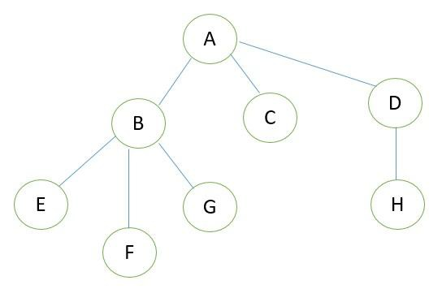

# Dependency Tree

A dependency tree organizes structures so there are explicit relationships
between entities. In a tree structure, each node can have only one parent but a
node may have many children. A dependecy tree can drawn between jobs,
softwares or items. For example, consider the dependency tree figure given
below:

A is referred as parent of B, C and D, B is parent of E, F and G and E, F and G
are children of B and so on. Given the details of all parent and child relationship
in a dependency tree and a name ‘m’, write a C++ code to find all dependencies
of ‘m’. The above tree structure contain seven parent child relation as follows:

A B

A C

B E

B F

B G

D H

For example, in the above tree, if ‘F’ is given then the dependencies are B and A.

#### Input Format

Number of parent child realtion in the tree, n

Next ‘n’ lines contain the name of the parent and the child nodes

Next line contains the name of the node whose dependency is to be found ‘m’

#### Output Format

Print the dependency node names from direct parent of the node ‘m’ in a line
separated by a space