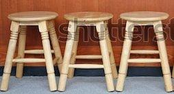

# Ways to Place Pot of Milk on Stools

‘n’ girls have arrived with pots of milk and these pots of milk has to arranged on
‘n’ stools which are arranged in a single row in a hall. The girls has are made to
stand in a queue as per their order of arrival and place the pot on any one of
the stool in the hall satisfying the rules:

1. First girl can keep the pot on whichever stool she wants

2. ‘nth’ girl where n>1, can keep the pot on a stool which is adjacent to a nonempty
stool

For example, when there is only one stool and only one girl ’x’ in the queue,
there is only one option to place the milk pot

When there are two stools and there are two girls ‘x’ and ‘y’ in the queue, there
are two ways to arrange the milk pots carried by them either ‘x’ -> ‘y’ or ‘y’->’x’

When there are three girls ‘x’, ‘y’ and ‘z’ in the queue, there are four ways to
arrange the milk pots carried by them. ‘x’->’y’->’z’, ‘z’->’y’->’x’, ‘y’->’x’->’z’, ‘z’ -> ‘y’ ->’x’

Given the value of n’, where ‘n’ is the number of girls with milk pot and the
number of stools in the hall, write a C program to find the number of ways in
which the milk pots can be arranged. For example, if n is 3 then there are 4 ways
as illustrated above.

#### Input Format

First line contains the value of ‘n’

#### Output Format

Print the number of ways in which the pot can be arranged