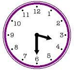

# Hands of the Clock

In the dial of an analog clock, tweleve alternate letters of the English alphabet
are written to indicate 1 to 12.

Capital letters are written and it may start from any letter A to D. Given the
letter from which numbering starts, a hour of a time, a minute of a time, write a
C program to find out the position of hour hand and minute hand. For example,
if the numbering starts from ‘D’ and the hour of the given time is 19 and minute
of the given time is 45 then the hour hand will be “Between P and R” and
minute hand will be “On T”. If the time is 07:00 then the hour hand will be “On
P” and minute hand will be “On Z”. Only valid time will be given as input, hour
will be given from 0 to 24 and minute will be from 0 to 59.

#### Input Format

First line contains the letter from which the numbering starts

Next line contains the hour of the time

Next line contains minute of the time

#### Output Format

In the first line, print the position of hour hand – Print On a particular letter or
Between two letters

In the next line, print the position of minute hand