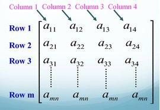

# Maximum Z-Sum

Z-Sum(i,j) in a matrix M is defined as the sum of the elements in matrix M at positions (i,
j), (i, j+1), (i+1, j), (i+1, j+1). Z-Sum(1,1) of the matrix shown in the figure is
a11+a12+a21+a22.

Given a mXn matrix, value of i and j, write a C program to find the maximum Z-Sum in
the matrix. Print the elements that form Z-structure in order that is print elements at
positions (i, j), (i, j+1), (i+1, j), (i+1, j+1). And also print all the positions i,j of the matrix
that corressponds to maximum Z-Sum. For example, given a 3X3 matrix as shown below:

1 2 3

2 4 7

1 2 3

The maximum z-sum is 16, the z-structures start with elements in position 1, 2 and 2, 2,
the elements that is on the maximum z-structures are 2 3 4 7 and 4 7 2 3.

#### Input Format

First line contains the number of rows in the matrix m, r

Next line contains the number of columns in the matrix m, c

Next r lines contain the elements of the matrix, one line has the elements of one row and
the elements in each column is separated by a space

#### Output Format

In the first line, print the maximum z sum

In the next 2*m lines, print the position of first element of Z-structure that has maximum
z sum followed the elements in the Z-structure with maximum sum in the next line, where
‘m’ is the number of z-structures with maximum z sum

The position of first element of Z-structure with maximum sum and elements in the Zstructure
with maximum sum has to be separated by a tab space. Print the elements in the
Z-structure in such a way that Z shape is formed when traversed