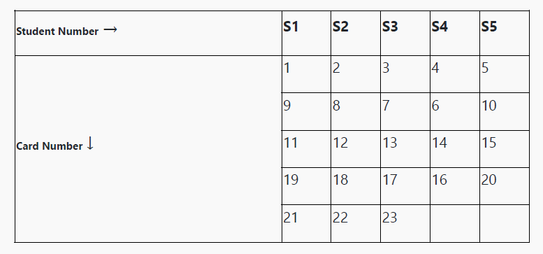

# Circular Distribution of Cards

A group of ‘m’ students are made to stand in a circle and the cards with
numbers 1 to n are distributed. The distribution is done with following stratergy:

1. First card is given to the first student

2. Then the cards are given in sequence till the ‘m ’ student is reached

3. Then the cards are distributed in reverse

4. No student will get two cards with consecutive numbers

That is in short, if the cards were distributed from 1 to m in one round then it
should be from ‘m-1’ to 1 and then m in the next round. For example, if there
are five students and cards with number 1 to 23 are distributed then the
distribution will be as follows:

Given the number of students in the circle, ‘m’ and the card number ‘c’, write a
C++ code to print the student number who might have recieved it. Students are
numbered 1 to m with prefix ‘S’. For example, card number 16 would have
recieved by student ‘S4’ and card number 23 would have recieved by student
number ‘S2’.

#### Input Format

First line contains the number of students in the circle, m

Next line contains the card number to be checked, c

#### Output Format

Print the student number with card, c