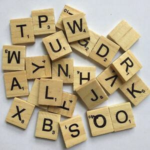

# Form Names with Tiles

Tiles with alphabets are arranged in a linear fashion and each tile in the
arrangement has an index ‘i’.

A child is given ‘n’ tiles and asked to check how many times he can form his
name by rearranging the tiles. But there is a constraint, to form his name once
the child can rearrange tiles from any position ‘p’ to position ‘p+q-1’ where q is
the length of the name of the child. For example, if the tiles are arranged are as
‘abacdefhjcabdaabefrt’ and the child’s name is ‘abcd’ then the child can form his
name by using tiles from position ‘2’ and using tiles from position ‘10’.

#### Input Format

First line contain the letters in the tile

Next line contain the name of the child

#### Output Format

Print the position of the tiles from where the child name can be formed