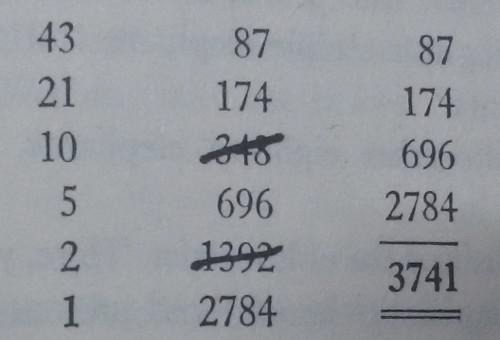

# Product of Two 2-Digit with ‘+’ and ‘/’

Based on the yesterday’s problem told by Karthik, Vijay got curious to know
more about tricks by Shakuntala Devi and he started reading her books. He
liked the trick which describes a method to find product of two 2-digit numbers
with ‘+’ and ‘/’ operators only. Given two 2-digit numbers ‘m’ and ‘n’,

(i) Write the lesser number ‘l’ on left side of a paper

(ii) Divide ‘l’ by 2 and write quotient on one line ignoring remainders till 1 is
reached.

(iii) Write the larger number on the right side of the paper in line number 1

(iv) Then for right side of each line, write double of the value in previous line.

(v) Strike out the lines of even quotients in left side.

(vi) Sum up the remaining values on the right side

This gives product of m and n.

Given two 2-digit numbers, write a C++ program to find product of the
numbers using above procedure and print the values on the left and right sides
of the papers that are not striked out in ascending order of left side value.

For example, if the numbers are 43 and 87 then the procedure works as follows:

And the expected output is:

1 2784

5 696

21 174

43 87

3741

#### Input Format

First line contains the first two digit number, m

Next line contains the second two digit number, n

#### Output Format

Print all the lines that are not striked out in the above procedure

Print the product of m and n