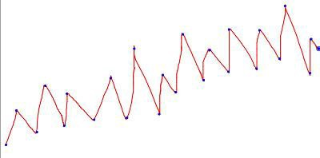

# Irregular Triangular Wave

Given ‘n’ integers, rearrange them to be points (points to be considered
are shown in blue colour) of a irregular triangular wave as shown below
with minimum number of swaps.

Irregular Triangular Wave

For example if seven points 4, 3, 7, 8, 6, 2, 1 are given then they are
rearranged to be points of irregular triangular
wave as 3, 7, 4, 8, 2, 6, 1 with minimum swaps.

#### Input Format

First line contains the number of integers, n

Next line contain the integers separated by a space

#### Output Format

Print the rearranged integers