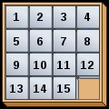

# Distance from Position in Sliding Puzzle

All of us might have played this sliding puzzle in our childhood.

Now consider a sliding puzzle of dimension nxn. The tiles of all these do not
start with 1, and let the starting number of the tiles be ‘s’. Given the shuffled
order of the tiles in the puzzle, write a C++ program to find the distance of
each tile from its original position. Distance of a tile from its original position is
defined as abs (number of rows displaced *2) + abs (number of columns
displaced). For example, if the shuffled tiles are as follows (Empty cell is
represented by -1):

41 53 42 44

43 46 48 52

49 47 50 55

45 54 51 -1

and starting tile number is 41 then the distance of the tiles are

41 – 0

53 – 2*3+1

42 – 1

44 – 0

43 – 2*1+2

46 – 0

48 – 1

52 – 2*1

49 – 0

47 – 2*1+1

50 – 1

55 - 2*1+1

45 - 2*2

54 – 0

51 – 2*1

#### Input Format

First line contains the value of n, dimension of sliding tiles

Next ‘n’ lines contain the value of tiles in each row

#### Output Format

Print the tile number and the distance of the tile from its original position
separated by a tab in the order given in the input