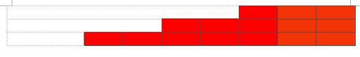

# Build a Staircase

Each step in a staircase built by a constructor has two bricks less than the
number of bricks used in the previous step as shown below.

Given the number of bricks ‘n’ available in a construction site and the number
of steps to be built ‘k’, write a C++ program to check if ‘k’ steps can be built
with exactly ‘n’ bricks. If ‘k’ steps can be built then print the number of bricks to
be used in each step starting from the last brick and print ‘Cannot be built’
otherwise.

For example if ‘n’ is 15 and ‘k’ is 3 then print 3, 5 and 7 and if ‘n’ is 17 and ‘k’ is 3
then print ‘Cannot be built’.

#### Input Format

First line contains the number of bricks in the construction site, n

Next line contains the number of steps to be built, k

#### Output Format

Print the number of bricks to be used in each step, starting from the last step if
‘k’ steps can be built with exactly ‘n’ bricks and print ‘Cannot be built’ otherwise